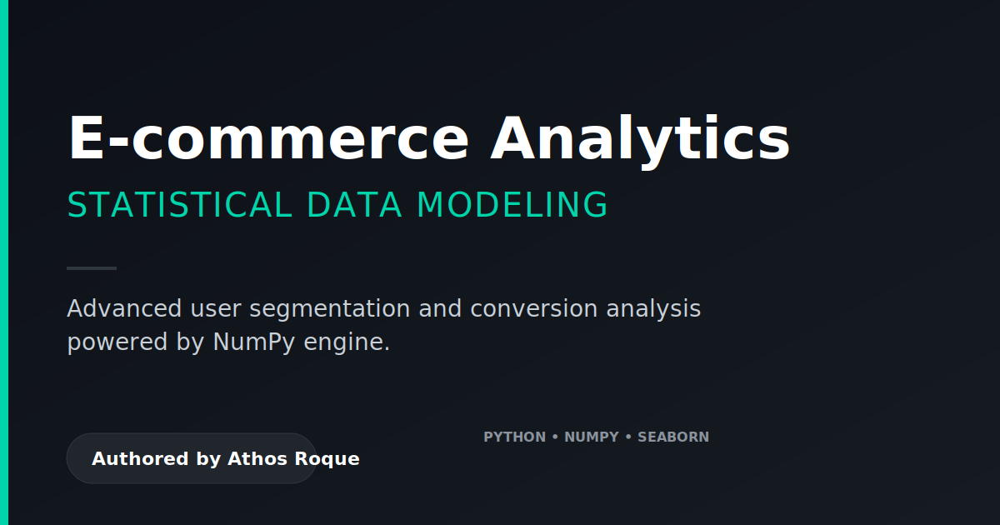
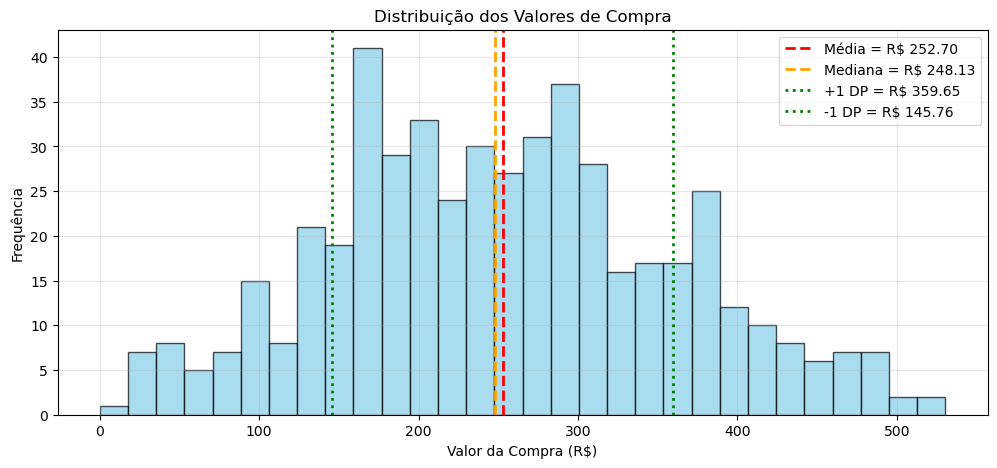
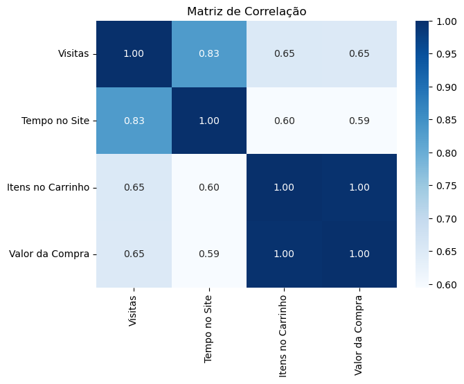

<div align="center">
  
</div>

# 🎯 Análise Estatística de Dados com NumPy

> Análise para identificar perfis de conversão, engajamento e oportunidades ocultas de remarketing.


---

## 🎯 Explore o Projeto
- **Notebook de Análise:** [Ecommerce_Analytics_NumPy.ipynb](notebooks/Ecommerce_Analytics_NumPy.ipynb)

---

## 📌 Problema de Negócio

Uma plataforma de e-commerce enfrentava o desafio clássico: como personalizar campanhas e otimizar a experiência do usuário sem depender apenas da intuição? A subutilização dos dados de navegação e compra levava a campanhas genéricas e perda de conversão.

O objetivo deste projeto foi transformar 500 registros de navegação brutos em uma **bússola estratégica** respondendo: qual é o perfil do comprador ideal, como prever a compra através do comportamento no site e quando investir em ações de remarketing.

## 🔍 Abordagem

1.  **Estruturação de Dados:** Manipulação e vetorialização de dados sintéticos controlados simulando cenários reais utilizando o **NumPy**.
2.  **Estatística Descritiva:** Neutralização de outliers e definição clara das métricas de centralidade (Média, Mediana, Desvio Padrão).
3.  **Análise de Perfis:** Segmentação de clientes com base em quartis para definir o avatar de "Alto Valor".
4.  **Análise Multivariada:** Aplicação de Matrizes de Correlação e Covariância para validar as alavancas de ticket médio.

## ✨  Resultados e Descobertas (Principais Insights)

>  **Hero Metric:** Ticket médio estabelecido em **R$ 252,70**, com forte correlação temporal indicando que o engajamento dita o volume final da cesta de compras.

### Tabela de Insights de Negócio

| Perspectiva | Descoberta Principal | Recomendação Estratégica |
| :--- | :--- | :--- |
| **Perfil Médio** | O cliente comum realiza **26 visitas/mês** e passa **33 min** navegando. | Definir essas métricas como "baseline" em campanhas de retenção. |
| **Alto Valor** | Clientes segmentados no topo gastam mais e visitam a loja **33x por mês** (27% acima da média). | Criar um programa VIP focado nos usuários com >30 visitas/mês. |
| **Correlação** | Forte ligação (**corr = 0.83**) entre o tempo de permanência e a quantidade de visitas. | Otimizar a jornada do usuário (UX) com recomendações de produtos na home para prolongar as sessões iniciais. |
| **Fricção** | Visitantes que não compram abandonam após **15 minutos**. | Disparar pop-ups de descontos temporários ou e-mails de remarketing para engajados quando a sessão passar dessa barreira temporal. |

## 📈 Visualizações Principais

<div align="center">
  
  <br>
  <em>Figura 1: Distribuição dos valores e análise de ticket médio (Média, Mediana e Desvio Padrão).</em>
</div>

<br>

<div align="center">
  
  <br>
  <em>Figura 2: Matriz de correlação validando o tempo no site como o principal preditor de conversão.</em>
</div>


## 🛠️ Stack Tecnológica

*   **Linguagem:** Python 3.10+
*   **Engine Estatística:** NumPy
*   **Apoio e Estruturação:** Pandas
*   **Visualização (Data Viz):** Matplotlib & Seaborn
*   **Documentação:** Jupyter Notebook, Shields.io, Markdown

## 📁 Estrutura do Projeto

```text
├── assets/             # Banners SVG e Plots estatísticos
├── notebooks/          # Ecommerce_Analytics_NumPy.ipynb
└── README.md           # Resumo estratégico e documentação central
```

## 🚀 Como Reproduzir

1.  Clone o repositório principal: `git clone https://github.com/athosroque/notebook-docs.git`
2.  Acesse o diretório: `cd notebook-docs`
3.  Instale as dependências: `pip install numpy pandas matplotlib seaborn`
4.  Execute o notebook localmente: `jupyter notebook notebooks/Ecommerce_Analytics_NumPy.ipynb`

---
**Desenvolvido por Athos Roque** - [LinkedIn](https://www.linkedin.com/in/athosroque) | [GitHub](https://github.com/athosroque)
